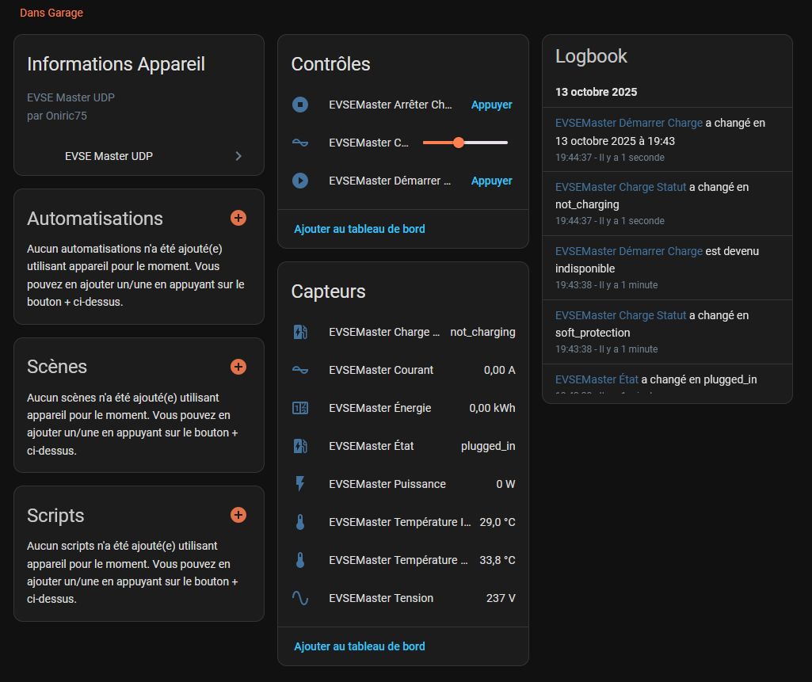
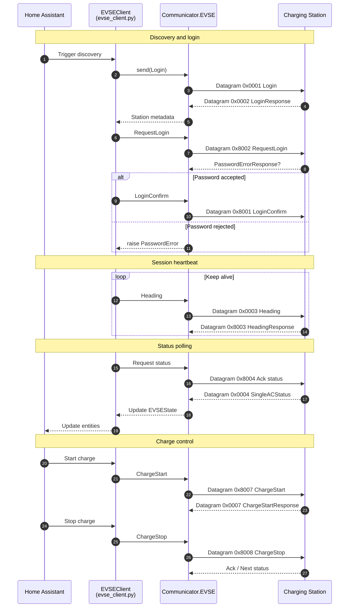

# EVSE Master UDP - Home Assistant Integration

> **🙏 Acknowledgment**
>
> This project is based on the excellent work of [johnwoo-nl/emproto](https://github.com/johnwoo-nl/emproto). Without their reverse-engineering of the EVSE Master UDP protocol, this Home Assistant integration would not have been possible. Full credit and thanks to the original author.

---

> **🚨 Disclaimer**
>
> This integration is provided "as is". Installing, configuring, or using it is entirely at your own risk. The author(s) accept no liability for any damage, malfunction, warranty loss, fire, injury, or other consequences resulting from its use. Always confirm that your charging station operates safely and complies with local regulations before use.

---

> **⚠️ Safety Warnings**
>
> - Repeated charge starts can prematurely wear your station's contactors; even with safeguards enabled, you assume full responsibility for any damage.
> - Never run the "EVSE Master" mobile app at the same time as this integration; simultaneous use will cause connection conflicts and may crash both systems.

---

## 📋 Table of Contents
- [🔌 Overview](#-overview)
- [⚠️ Important Warnings](#️-important-warnings)
- [🏗️ Compatibility](#️-compatibility)
- [🚀 Installation](#-installation)
  - [HACS](#hacs)
  - [Manual](#manual)
- [⚙️ Configuration](#️-configuration)
- [📊 Device Overview](#-device-overview)
- [🛠️ Features](#️-features)
- [🔧 Advanced Configuration](#-advanced-configuration)
- [📚 Automation Examples](#-automation-examples)
- [🐛 Troubleshooting](#-troubleshooting)
- [🆘 Support](#-support)
- [📄 License](#-license)
- [👨‍💻 Development](#-development)

---

## 🔌 Overview

Home Assistant integration for EVSE Master UDP compatible charging stations. Control and monitor your EVSE through the UDP protocol used by the mobile app.

## ⚠️ Important Warnings

**Built-in protections:**
- Rapid change protection
- 16A safety fallback on error
- Minimum delay between cycles

**Recommendations:** Avoid frequent short cycles, plan automations carefully, monitor hardware, and disable the integration before using the mobile app.

## 🏗️ Compatibility

Tested with Morec, generic EVSE devices using UDP port `28376`, and some Chinese charging stations that use the EVSE Master protocol.

## 🚀 Installation

### HACS

This is the recommended method because updates are tracked automatically. In Home Assistant, open HACS, go to Integrations, then use the three-dot menu to open Custom repositories. Paste the repository URL `https://github.com/Oniric75/evsemasterudp` and select type `Integration`. Then search for `EVSE Master UDP` inside HACS, install it, and restart Home Assistant.

### Manual

Use this only if you do not use HACS. Download the latest release archive from GitHub, extract it, and copy the folder `evsemasterudp` that contains `manifest.json` into your Home Assistant `custom_components/` directory. Ensure the final path is `custom_components/evsemasterudp/`. Restart Home Assistant and the integration should appear in the Add Integration dialog.

## ⚙️ Configuration

During setup you provide:
- The EVSE serial number
- The password configured in the official mobile app
- Optional EVSE IP address for static routed setups such as VPN links
- Optional UDP port, default `28376`
- Optional friendly name

There is currently no user-facing setting for update interval or network timeout. The integration refreshes internally every 60 seconds. Fast-change protection delay is managed by the numeric entity rather than in the config flow.

**Fields:**
- Serial: Used to locate and authenticate the charger.
- Password: Required for login and stored in plain text in the Home Assistant config entry.
- Host: Optional static EVSE IP. When set, the integration skips passive broadcast discovery and talks directly to that endpoint.
- Port: UDP port; keep the default unless your device differs.
- Name: Friendly label for entities.

## 📊 Device Overview

<p align="center">
  
</p>

Example of the device page in Home Assistant showing key sensors, charge control buttons, and the charge status with cooldown indicator.

> The exact entity names may vary depending on the friendly name chosen during setup.

### Implemented Entities
- State, power, current, voltage, energy, and temperatures
- Charge status with soft protection and `cooldown_remaining_s`
- Start and stop charge buttons
- Rapid change protection number entity in minutes

### Planned
- Additional configuration parameters such as offline charge and fees

## 🛠️ Features

- Auto discovery
- Secure password authentication
- Real-time status
- Charge control
- Parameter configuration
- Session history
- Built-in protections

## 🔧 Advanced Configuration

Current defaults and operating behavior:
- Internal update cadence is currently 60 seconds
- Rapid change protection is enabled by default
- Cooldown timing is managed through the number entity

## 📚 Automation Examples

### Off-peak charging

```yaml
automation:
  - alias: "EVSE charge off-peak"
    trigger:
      - platform: time
        at: "22:30:00"
    condition:
      - condition: state
        entity_id: binary_sensor.vehicle_connected
        state: "on"
    action:
      - service: button.press
        target:
          entity_id: button.evsemaster_demarrer_charge
```

### Stop at 80%

```yaml
automation:
  - alias: "Stop charge at 80%"
    trigger:
      - platform: numeric_state
        entity_id: sensor.vehicle_battery_level
        above: 80
    action:
      - service: button.press
        target:
          entity_id: button.evsemaster_arreter_charge
```

## 🐛 Troubleshooting

- Not detected: confirm the charger is powered on, on the same network, and that UDP port `28376` is not blocked.
- Authentication failed: verify the password and serial number.
- Connection lost: check network stability, polling cadence, and conflicts with the mobile app.

## 🆘 Support

- Issues: https://github.com/Oniric75/evsemasterudp/issues
- Discussions: https://github.com/Oniric75/evsemasterudp/discussions
- Wiki: https://github.com/Oniric75/evsemasterudp/wiki

## 📄 License

MIT License. See `LICENSE`.

---

## 👨‍💻 Development

<details>
<summary>Developer Information</summary>

### Project Structure

```text
evsemasterudp/
├── __init__.py          # Integration entry point
├── manifest.json        # Integration metadata
├── config_flow.py       # Configuration interface
├── evse_client.py       # Main EVSE client
├── sensor.py            # Sensors
├── button.py            # Start/stop buttons
├── number.py            # Number controls
├── protocol/            # Protocol implementation
│   ├── __init__.py
│   ├── communicator.py  # UDP communication
│   ├── datagram.py      # Datagram structure
│   └── datagrams.py     # Message types
└── tests/               # Unit tests
    ├── test_basic.py
    ├── test_discovery.py
    └── test_full.py
```

### EVSE Master UDP Protocol

- Default port: `28376`
- Communication: bidirectional UDP
- Authentication: plain text password
- Discovery: automatic broadcast

#### Sequence Overview



### Development Testing

```bash
# Activate virtual environment
.venv/Scripts/activate  # Windows
source .venv/bin/activate  # Linux/Mac

# Basic tests
python tests/test_basic.py

# Discovery test
python tests/test_discovery.py

# Full test with real station
python tests/test_full.py
```

### Development Requirements

- Python 3.11+
- Home Assistant Core 2024.1+
- A compatible EVSE station on the local network

### Protocol Coverage

This integration implements **75.7% of the TypeScript reference protocol** (`30/37` commands).

#### ✅ Implemented Commands (30)
- Authentication: login sequence (`0x8002`, `0x0002`, `0x0001`)
- Status monitoring: various status commands (`0x0003`, `0x0004`, `0x0005`, `0x000d`)
- Control: charging control (`0x8104`, `0x0104`, `0x8105`, `0x0105`)
- Configuration: current, fees, system settings (`0x8106-0x810d`, `0x0106-0x010c`)
- Data transfer: local charge records (`0x000a`, `0x800a`)

#### ❌ Not Implemented (7)
- Interface configuration (`0x810a`, `0x010a`, `0x810b`, `0x010b`)
- Language settings (`0x8109`, `0x0109`)
- Nickname management (`0x8108`, `0x0108`)
- Temperature unit settings (`0x810f`, `0x010f`)

### Contributing

Contributions are welcome.

1. Fork the project
2. Create a feature branch
   `git checkout -b feature/amazing-feature`
3. Commit your changes
   `git commit -m 'Add amazing feature'`
4. Push to the branch
   `git push origin feature/amazing-feature`
5. Open a Pull Request

### Release Process

1. Update the version in `manifest.json`
2. Create an annotated tag: `git tag -a vX.Y.Z -m "Release notes"`
3. Push the tag: `git push origin vX.Y.Z`
4. Create a GitHub release with a changelog

### Testing Guidelines

- Always test with real EVSE hardware when possible
- Include protocol packet captures for new features
- Test authentication edge cases
- Verify Home Assistant compatibility with recent versions

</details>

---

## 🙏 Acknowledgments

This project is based on the original work of [johnwoo-nl/emproto](https://github.com/johnwoo-nl/emproto) and has been ported and extended for Home Assistant.
